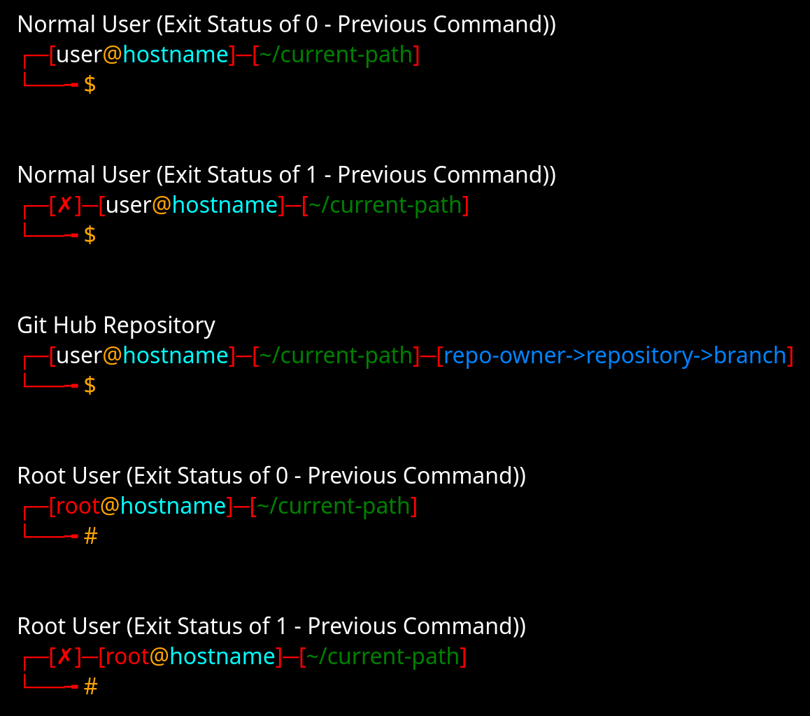

# bash-prompt

If you're here, you're likely in the wrong place...but in the unlikely scenario that you came here intentionally, welcome...

Pushing my .bashrc code so that I can reusue it between systems / for multiple builds.  

I haven't had any issues with this so far, and I like the formatting and bracketing.  It makes the prompt very easy to read at a glance.

